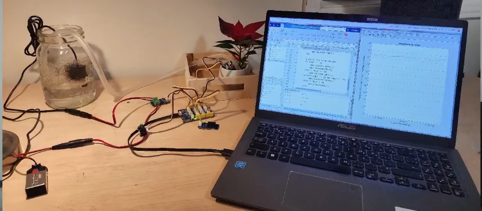
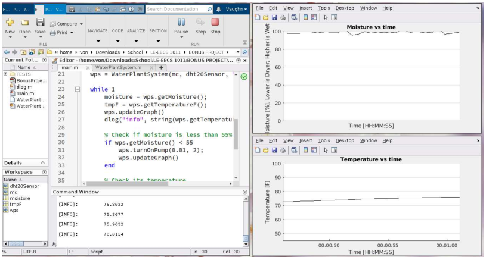

# AT-PWS (Automated Temperate-Sensitive Plant Watering System)

## About this project
This project was submitted for LE-EECS 1011 during Fall 2023 as a
bonus project. Using Matlab and an Arduino microcontroller, I
successfully implemented an autonomous plant watering system. It can
detect both the moisture of soil as well as the average temperature of
the room.

## How it works
A sensor is connected to the soil, which reads data on the moisture of
the soil. If the soil is detected as dry, then the computer running
Matlab will run pump water into the soil until moisture is low. If the
temperature is detected to be too low, then an LED "heater" light
turns on. If the temperature is too cold, then a buzzer is activated
to warn that the plant requires attention.

## Examples

### The Project Setup

### Measurement of Soil Moisture and Degrees

